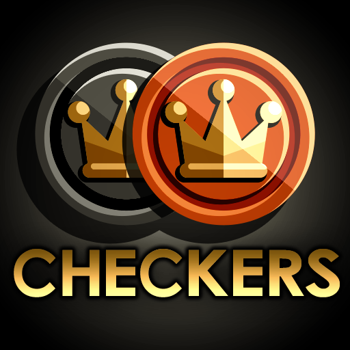

<!-- PROJECT LOGO -->
 

  

<!-- TABLE OF CONTENTS -->

  <ol>
    <li>
      <a href="#sobre">Sobre</a>
      <ul>
        <li><a>Grupo</a></li>
        <li><a>Desenvolvimento</a></li>
      </ul>
    </li>
  </ol>

<!-- ABOUT THE PROJECT -->
## Sobre

Jogo das Damas é um jogo de tabuleiro​

### Grupo 1

* José Bernardo Silva Azevedo 23791 👨
* Tiago Alberto Neves da Silva  22283  👨
* Gaspar Vilas Espinheira  23761  👨

### Desenvolvimento

Esta jogo de tabuleiro foi desenvolvido num espaço de 4 semanas, com as seguintes tecnologias:

* [Java](https://www.java.com/pt-BR/)
* [JavaFX](https://openjfx.io)
